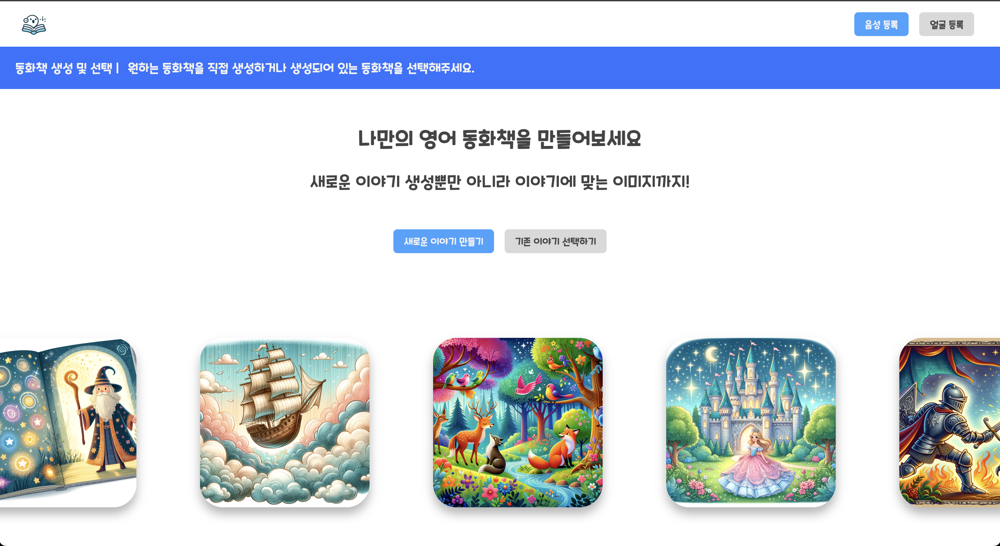
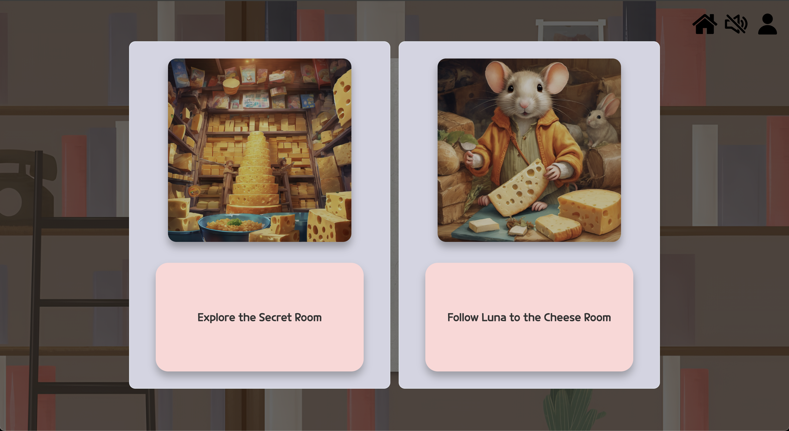
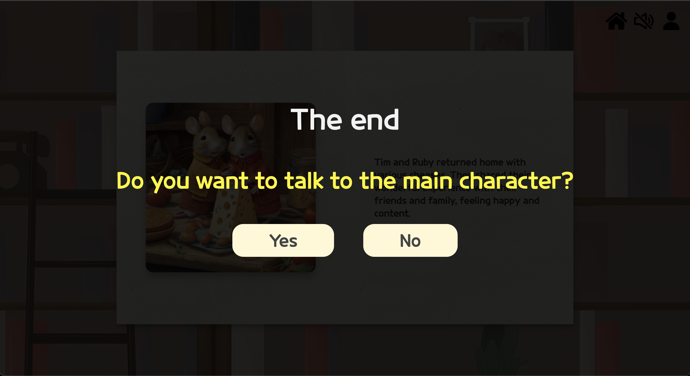
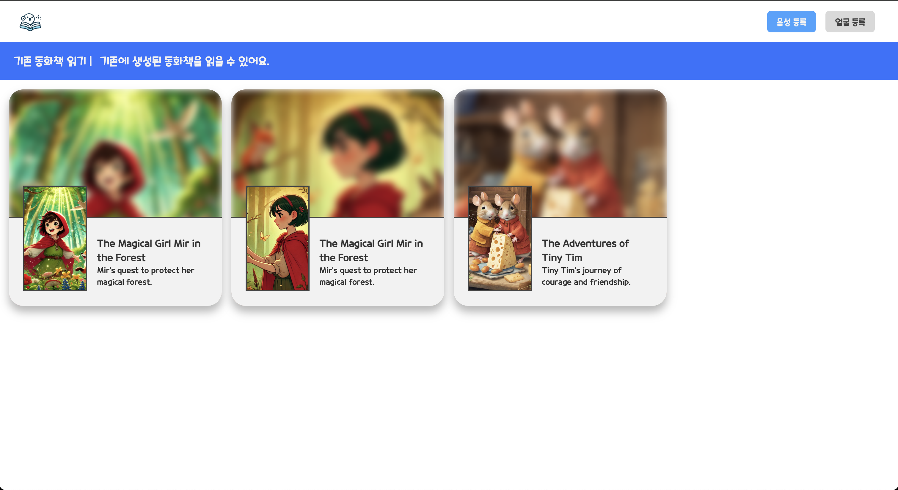

# 캡스톤 개발 ImageTale

LLM을 활용한 인터랙티브 영어 동화책 서비스

배포 주소: https://imagetale.mooo.com

## 프로젝트 소개

### 랜딩 페이지

새로운 이야기 만들기 버튼을 통해 미리 만들어져있는 목업 데이터 중 하나를 기반으로 이야기를 생성할 수 있습니다.

기존 이야기 선택하기 버튼을 통해 이전에 만들었던 동화를 다시 읽을 수 있습니다.

### 새로운 이야기 페이지

왼쪽 페이지를 클릭해 뒤로 갈 수 있고, 오른쪽 페이지를 클릭해 앞으로 갈 수 있습니다.

우상단 헤더를 활용해 홈으로 이동할 수 있고, 토킹헤드를 끄거나 음소거할 수 있습니다.

이야기를 진행하던 도중, 선택지를 만나면 둘 중 하나를 선택해야 합니다.

선택지를 기점으로 동화의 내용이 달라집니다. 이는 트리 형태로 구성된 JSON을 활용해 구현했습니다.

동화를 끝까지 진행시키면, 동화책 주인공과 대화할 수 있는 채팅 페이지로 이동할지 물어봅니다.

사용자가 선택한 페이지들의 내용을 기반으로 답변하도록 GPT API를 활용했습니다. (GPT API는 비활성화 되어있습니다.)

### 기존 이야기 페이지

끝까지 진행시켰던 동화들을 골라 다시 읽어볼 수 있습니다. 이 동화들은 선택지가 존재하지 않고, 선택되었던 대로 보여지게 됩니다.

회원 기능을 구현하지 않았기 때문에, 현재는 모든 사용자가 생성했던 동화가 보여지게 됩니다.

DB 또한 연결되어있지 않아, 서버가 죽으면 모든 기존 이야기는 사라지게 되어있습니다.

---

## 사용 기술 스택

FE:

- Build: `Vite`
- Language: `TypeScript`
- Framework: `React`
- Routing: `React-Router`
- Icon: `react-icons`
- CSS: `Styled-components`
- Http: `Axios`
- Book Rendering: `React-PageFlip`

BE:

- Framework: `FastAPI`
- Language: `Python`
- LLM: `OpenAI`
- Env: `python-dotenv`

Deploy:

- FE: `NginX`
- BE: `NginX` + `Docker`

---
